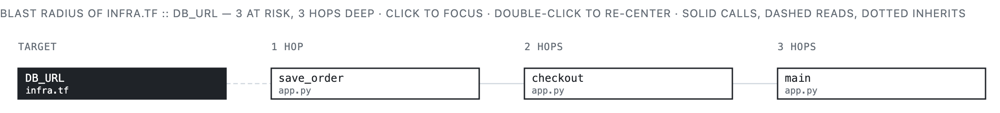

# CodePulse

**A live map of your repo, for you and your AI coding agent.**

For developers who work with an AI coding agent (Claude Code, or any MCP
client) in a repo that mixes languages: Python and TypeScript, plus the
Dockerfiles, Terraform, and YAML that wire them together.

---

## The map

CodePulse keeps one live map of everything in your repo and what touches
what, across every language.


This is [`examples/shop`](examples/shop), six files in five languages. The
blue lines are the point: a `COPY` in a Dockerfile, a `<script src>`, and an
`os.environ["DB_URL"]` that reaches a Terraform variable. A tool that reads
one language at a time can't see them.

## Two readers

You read the map in a panel; your agent reads the same map as tools. The
answers are the same.


## Six questions

| Ask | Your agent calls | You click |
|---|---|---|
| What is this? | `pulse_what` | WHAT |
| Who touches it? | `pulse_who` | WHO |
| What breaks if I change it? | `pulse_radius` | BREAKS |
| What did my change touch? | `pulse_changed`, `pulse_delta` | CHANGED |
| Where does X live? | `pulse_locate` | WHERE |
| Where does it start? | `pulse_handlers`, `pulse_map` | HANDLERS, MAP |

Before you edit `DB_URL` in Terraform, ask what breaks:



An agent asking `pulse_radius DB_URL` gets the same three functions as text,
in one call, without opening a file.

## Get started

You need Python 3.11+ and [uv](https://docs.astral.sh/uv/), on macOS or Linux.

```sh
uv tool install git+https://github.com/sumitrj/CodePulse   # puts `codepulse` on your PATH
codepulse install                                          # once per machine
```

Now start Claude Code in any repo, and the map is there. The first question
in a repo builds its map; after that, only files you've changed are read again.

- **Ask about another repo** without changing directory: every tool takes an
  optional `repo` path.
- **Open the panel** for the repo you're in: `codepulse .` prints its URL.
  In VS Code or Cursor, [the extension](extension/) puts it in the sidebar.
- **Try the example first**: clone this repo and run `codepulse examples/shop`.

`codepulse install` registers the tools once for your user (`claude mcp add
--scope user`), installs a short [skill](codepulse/skill/SKILL.md) that tells
Claude to ask the map before searching, and pre-approves the tools. Every
tool only reads. Maps live in `~/.cache/codepulse/`, so asking never writes
into your repo. (`codepulse .` keeps that repo's map in `.codepulse/`,
ignored by git.)

## Can you trust it?

**It's fresh.** Save a file, and the next answer includes it.

**It's honest.** It only claims what it can prove. A function called only
through dynamic dispatch shows "nothing on the map calls this", not a guess.
When two things share a name, the answer says so and names the other one.

**It's measured.** Take 500 real bug reports from
[SWE-bench Verified](https://www.swebench.com/), and ask which files the fix
had to change, given only the issue text. The map plus keyword search puts
the right file first more often than keyword search alone. On its own, the
map is worse.


The method, and what it doesn't show, is in [How I tested it](docs/HOW_I_TESTED.md).
That benchmark is all Python, so the cross-language edges aren't measured yet.

## Languages

Seven ship today: Python, TypeScript, TSX, YAML, Dockerfile, Terraform, HTML.
Each language is one YAML file (a *recipe*), not code; the Dockerfile recipe
is 12 lines. To add one, see [Contributing](docs/CONTRIBUTING.md).

## Docs

| If you want to… | Read |
|---|---|
| Check the numbers yourself | [How I tested it](docs/HOW_I_TESTED.md) · [`bench/`](bench/README.md) |
| Compare with and without the map on your own repo | [The A/B](demo/benchmark.md) |
| Add a language or change the code | [Contributing](docs/CONTRIBUTING.md) |
| Write about CodePulse | [The explanation ladder](docs/EXPLANATION.md) |
| See the original vision | [PRD](docs/PRD.md) |
